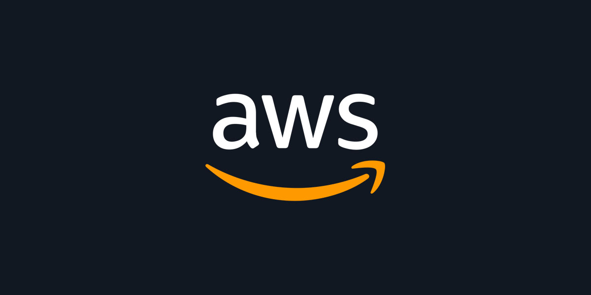
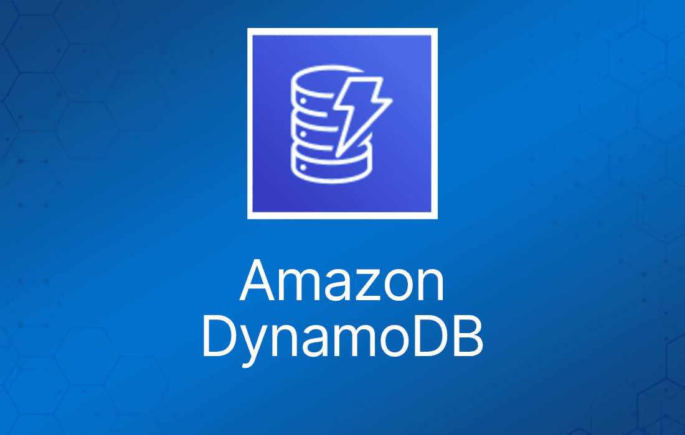
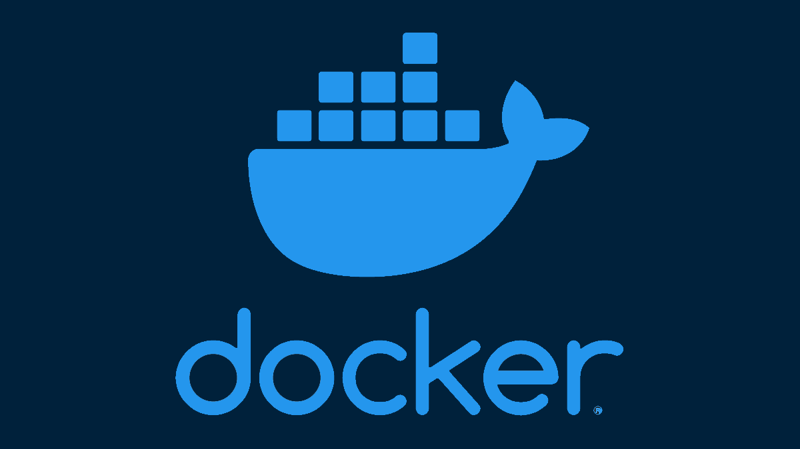

<p align="center">
  
  &nbsp;&nbsp;&nbsp;
  
  &nbsp;&nbsp;&nbsp;
  
  &nbsp;&nbsp;&nbsp;
</p>

# 🚀 Aprendendo LocalStack - Dynamodb

[](https://github.com/thiagovilarinholemes/LocalStack-com-DynamoDB/blob/main/LICENSE)


[]()

## ⚙️ Criando o Ambiente Virtual Python

Para criar o Ambiente Virtual Python digite os comandos abaixo

```
# Cria o Ambiente Virtual
python -m venv .venv

# Ativa o Ambiente Virtual
.venv\Scripts\activate
```

## ⚖️ Criando o Docker

Abaixo um exemplo de script docker com Dynamodb:

```
# Define os serviços que serão executados pelo Docker Compose.
services:

  # Nome do nosso serviço.
  localstack:

    # Imagem oficial do LocalStack.
    image: localstack/localstack:latest

    # Nome que o container receberá.
    container_name: localstack

    # Mapeia a porta do LocalStack.
    ports:
      - "4566:4566"

    # Variáveis de ambiente.
    environment:

      # Indica quais serviços queremos utilizar.
      # Neste projeto utilizaremos apenas o DynamoDB.
      - SERVICES=dynamodb

      # Define o nível de log.
      - DEBUG=1

      # Define o nome padrão da região AWS.
      - AWS_DEFAULT_REGION=us-east-1

      # Diretório interno utilizado pelo LocalStack
      # para armazenar dados persistentes.
      - PERSISTENCE=1

      # Define o token de autenticação do LocalStack.
      - LOCALSTACK_AUTH_TOKEN=ls-FAtuneQI-Bica-Poru-4263-8388KOfO2f2a

    # Monta um diretório local dentro do container.
    volumes:

      # Permite que o LocalStack mantenha os dados.
      - "./.localstack:/var/lib/localstack"

      # Permite que o Docker socket seja utilizado.
      - "/var/run/docker.sock:/var/run/docker.sock"

```

Comando para criar o Docker e instalar as dependências:
```
# Cria o Docker
docker compose up -d

# Instala as dependências
pip install -r requirements.txt
```

## 🔧 Testar o LocalStack

Comando:
```
curl http://localhost:4566/_localstack/health
```

## 📌 Instalando o AWS CLI

Digite o comando no terminal:
```
msiexec.exe /i https://awscli.amazonaws.com/AWSCLIV2.msi
```

Caso não encontre pesquise sobre download AWS CLI.

##

Comando para configurar:
```
aws dynamodb list-tables --endpoint-url http://localhost:4566 --region us-east-1
```

ou

```
aws configure

Ele vai perguntar:

AWS Access Key ID [None]:

Digite: test

Depois:

AWS Secret Access Key [None]:

Digite: test

Depois:

Default region name [None]:

Digite: us-east-1

Depois:

Default output format [None]:

Digite: json
```

## Comando para CRUD

Criar a tabela:
```
python -m scripts.criar_tabela
```

Inserir dados:
```
python -m scripts.inserir
```

Atualizar dados:
```
python -m scripts.atualizar_dados
```

Consultar dados
```
python -m scripts.consultar_dados
```

Deletar dados:
```
python -m scripts.deletar_dados
```

## Comando para rodar o Streamlit

```
streamlit run app.py
```

## 👨‍💻 Sobre

👤 Autor: Thiago Vilarinho Lemes <br>
🏠 Home: https://thiagolemes.netlify.app/ \
🔗 LinkedIn: <a href="https://www.linkedin.com/in/thiago-v-lemes-b1232727" target="_blank">Thiago Lemes</a><br>
✉️ e-mail:contatothiagolemes@gmail.com | lemes_vilarinho@yahoo.com.br
